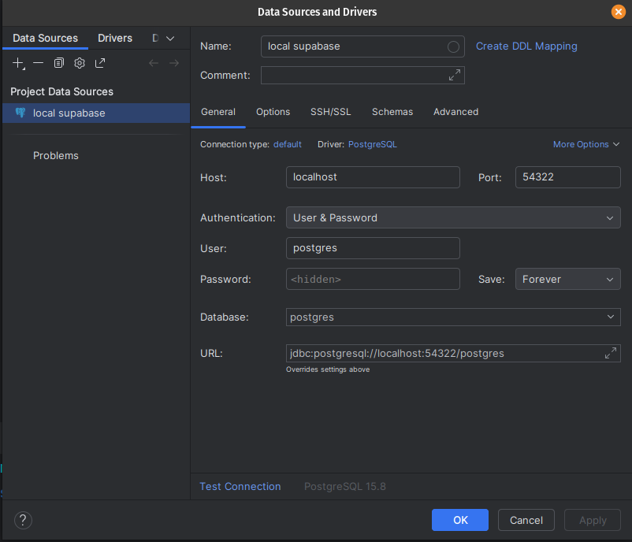

# Bike Lane Picker Frontend

An app to pick bike lanes (primarily around Philadelphia).
It is written in React + Typescript and has a 
Supabase backend.

## Requirements
- [Node v22.3.0](https://nodejs.org/en)
- [Docker + Docker Desktop](https://www.docker.com/get-started/)

## How to run locally - Frontend
To get started with the frontend - should be as simple
as running these commands:

```shell
npm i
npm run dev
```

## How to run locally - Backend (Local Supabase)
For local development, a local instance of Supabase
is needed. This is how to start it up.

```shell
npx supabase start
```

## Webstorm Setup
For Development, I'm primarily using Webstorm to code.
There are a few steps that can be done to make development
easier on it.

### Tailwind 4 Support
Tailwind 4 is not naturally supported by Webstorm out of the
box. [Here's](https://youtrack.jetbrains.com/issue/WEB-70442/Support-Tailwind-CSS-4#focus=Comments-27-11192433.0-0) a thread with instructions on how to set it up.

### Local Database Setup
For local development, it is handy to have a local instance
of Supabase's Database. Below is an image of my Webstorm's
database configuration.

The User, Password, and Database are all just `postgres`

